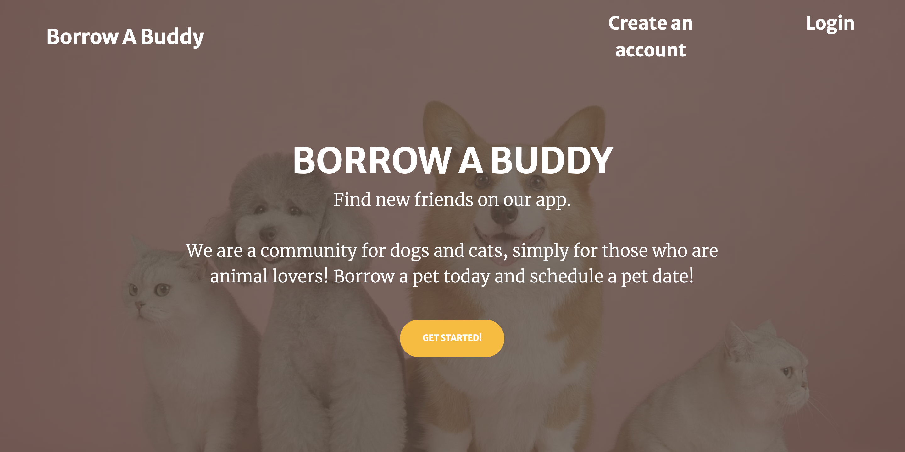

Borrow a Buddy

This is a full stack app about being able to borrow a cat or a dog for the day without commitment. The user will be able to sign up or login to create account. This way we can verify if they are legit or not. There will also be profiles of the available "buddies" to borrow.

How It's Made:
Client-side: HTML, CSS, JavaScript, Express, Node.js, and MongoDB

Optimization:

What I learned: Using CRUD function

